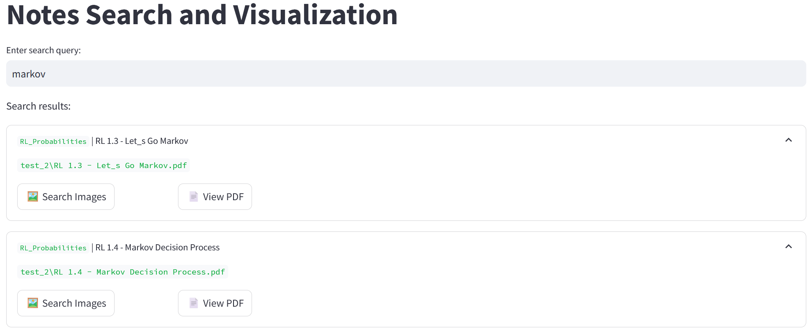
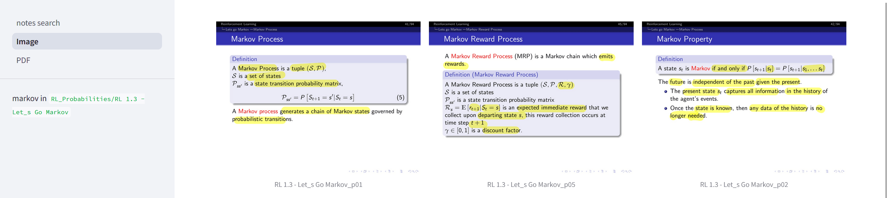
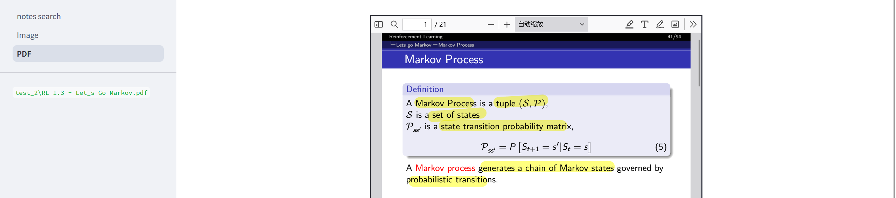

# PDF Notes Searching
PDF and OCR based notes searching. Index your notes and search for keywords. 
- PDF conversion to images
- OCR on images to texts
- Index texts (hierarchical! PDF-sum and individual images)
- Search! view PDF or view images found

## Quick Start
- `pip install -r requirements.txt`
- Prepare 'database': 
    - TODO: make UI
    - For now: 
        - in `ocr.py`, modify `convert_pdf_in_directory("your folder full of PDF notes", "a tag")` and run
        - run `whoosh_search.py` to build index for all data by default
- Web UI: `streamlit run .\notes_search.py`
    - go to `http://localhost:8501` if not already

## TO-DO:
- add a page to allow adding notes to index through UI
- fuzzy search
- multi-select tags to search in
